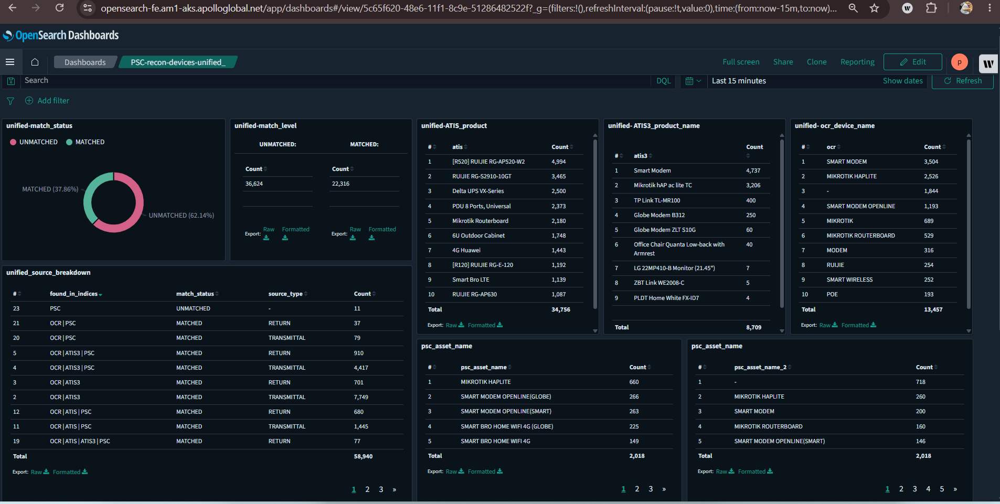

#  Automated Data Pipeline: Google Sheets to OpenSearch Unified Sync 

An automated data engineering pipeline that synchronizes, normalizes, and reconciles master inventory data and OCR records into an OpenSearch cluster. Built using **Node.js** and orchestrated via **GitHub Actions** for hands-free daily tracking.

##  Key Features

* **Automated Scheduling (Cron Jobs):** Workflows trigger automatically during off-peak hours (PHT) using GitHub Actions schedules to maintain fresh datasets without manual intervention.
* **Data Aggregation & Cross-Index Reconciliation:** Features a high-performance lookup mechanism (`unified-recon.js`) that processes and cross-references data across 4 distinct asset management sources based on serial number mapping.
* **Failsafe Edge-Case Handling:** Implements data validation logic to clean up formatting discrepancies (e.g., standardizing empty spaces, 'none', or hyphens into clean data blocks) and bypass index dynamic mapping rejection errors.
* **Optimized Bulk Upserts:** Processes records dynamically using OpenSearch Bulk API chunks (up to 2,000 documents per batch) with real-time feedback logs to maximize efficiency and avoid runner time-outs.

### 🛠️ Step-by-Step Integration & Setup Guide

Follow these exact steps to retrieve the necessary Google Cloud API credentials, connect your data layers, and configure the automation pipeline.

#### Step 1: Generate Google Sheets API Credentials (JSON Key)
To allow the Node.js automation scripts to securely access and read your tracking sheets, you must set up a Google Cloud Service Account:
1. Log in to the **[Google Cloud Console](https://console.cloud.google.com/)**.
2. Select an existing project or create a new one for your data sync pipeline.
3. In the top search bar, search for **"Google Sheets API"**, select it, and click **Enable**.
4. Navigate to the left-side navigation menu and go to **IAM & Admin > Service Accounts**, then click **Create Service Account** at the top.
5. Provide a service account name (e.g., `opensearch-sync-service`) and click **Create and Continue**, then click **Done**.
6. In the Service Accounts list, click on the email address of the account you just created.
7. Go to the **Keys** tab > click **Add Key > Create new key**, select **JSON** as the key type, and click **Create**.
8. A `.json` credential file will automatically download to your computer. **This file represents your `SERVICE_ACCOUNT_JSON`**.

#### Step 2: Grant Google Sheets Access to the Service Account
Because your operational Google Sheets are private, you must explicitly invite the Service Account to view the data:
1. Open the downloaded `.json` file using any text editor (like Notepad) and locate the line containing `"client_email"`. Copy that email address (it looks like: `account-name@project-id.iam.gserviceaccount.com`).
2. Open your target operational Google Sheet (e.g., your OCR Transmittal or Inventory spreadsheet).
3. Click the **Share** button in the top-right corner.
4. Paste the copied `client_email` address, uncheck "Notify people", set the role permission to **Viewer** (or Editor if writebacks are required), and click **Share**.

### Step 3: Extract the Google Sheet IDs
The script targets specific spreadsheets using their unique alphanumeric identifiers found directly in the browser URL:
1. While viewing your Google Sheet, look at your browser's address bar.
2. Highlight and copy the long string of letters and numbers located between `/d/` and `/edit`.
   * *Example URL:* `https://docs.google.com/spreadsheets/d/1YoF37pKbs_XXXXXXXXXXXXXXXXXX`
   * *Your extracted Sheet ID is:* `1YoF37pKbs_iVFIIDbDbc1ffhJJazEXXXXXXXXXXXXX`
3. Save this string for your `GOOGLE_SHEET_ID_INPUT` and `GOOGLE_SHEET_ID_OCR` configurations.

#### Step 4: Configure GitHub Repository Secrets
To allow the automated GitHub runner to securely consume your connection settings without committing credentials directly into the code repo:
1. Navigate to your GitHub repository page and click **Settings > Secrets and variables > Actions**.
2. Click the green button labeled **New repository secret**.
3. Create a secret named `SERVICE_ACCOUNT_JSON` and paste the **entire text contents** of your downloaded `.json` file inside the value field.
4. Create additional repository secrets for your Sheet IDs and OpenSearch access credentials:
   * `OPENSEARCH_URL` — Endpoint link to your active cluster.
   * `OPENSEARCH_USERNAME` & `OPENSEARCH_PASSWORD` — Cluster access privileges.
   * `GOOGLE_SHEET_ID_INPUT` & `GOOGLE_SHEET_ID_OCR` — The extracted IDs from Step 3.
   * `INDEX_NAME_INPUT` & `INDEX_NAME_OCR` — The destination indexing paths.

#### Step 5: Automated Cron Job Sequence
Once all files are saved and configuration secrets are active, the pipeline runs entirely hands-free. GitHub Actions orchestrates the workflows sequentially every morning (PHT) as follows:
* **3:00 AM PHT (`0 19 * * *`):** `sync-input.yml` triggers to fetch raw master file items and sync them to the input index.
* **3:15 AM PHT (`15 19 * * *`):** `sync-ocr.yml` executes to fetch, process, and clean fresh OCR transmittal rows.
* **4:00 AM PHT (`0 20 * * *`):** `sync-unified.yml` triggers the final lookup script (`unified-recon.js`) to completely merge and reconcile device layers across all active data blocks.
---

##  System Architecture & Workflow

1. **Ingestion Layer:** Reads live operational asset layers from Google Sheets tabs (`OCR`, `MATCH`, `MISSING`) via the Google Sheets and Google Auth API.
2. **Processing Layer (Node.js):** Cleans, converts types, standardizes key attributes, and normalizes inputs to prepare them for synchronization.
3. **Storage & Monitoring Layer:** Resets target indices cleanly and bulk-uploads fresh data into your OpenSearch cluster, yielding a unified view (`psc-recon-devices-unified`).

---

##  Tech Stack

* **Runtime Environment:** Node.js (v20)
* **Database Cluster:** OpenSearch (Client `@opensearch-project/opensearch`)
* **Integrations:** Google Auth Library, Google Spreadsheet API, ExcelJS
* **Orchestration & CI/CD:** GitHub Actions

---

##  Environment Variables Required

To run this pipeline successfully inside GitHub Actions, ensure the following keys are added to your **Repository Secrets**:

* `SERVICE_ACCOUNT_JSON` - Complete Google Cloud service account JSON credentials.
* `OPENSEARCH_URL` - Endpoint URL of your active OpenSearch cluster.
* `OPENSEARCH_USERNAME` & `OPENSEARCH_PASSWORD` - Administrative cluster access credentials.
* `GOOGLE_SHEET_ID_INPUT` & `GOOGLE_SHEET_ID_OCR` - Target Google Sheets IDs for data fetching.
* `INDEX_NAME_INPUT` & `INDEX_NAME_OCR` - Destination index identifiers.

---

##  Automated Workflows Configuration

The automation routines run sequentially every morning (PHT):
* **Input Sync (`sync-input.yml`):** Automatically processes master files at 3:00 AM PHT (`0 19 * * *`).
* **OCR Transmittal Sync (`sync-ocr.yml`):** Runs at 3:15 AM PHT (`15 19 * * *`).
* **Unified Device Reconciliation (`sync-unified.yml`):** Combines and evaluates duplicate layers at 4:00 AM PHT (`0 20 * * *`).

